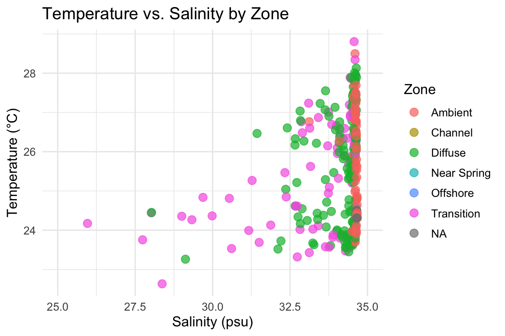

# Wk6_HW6
Jordan Vest

<script src="Wk6_HW6_Script_final_files/libs/kePrint-0.0.1/kePrint.js"></script>
<link href="Wk6_HW6_Script_final_files/libs/lightable-0.0.1/lightable.css" rel="stylesheet" />

# Introduction

Today we are practicing with Quarto and completing the following tasks.

- Data import
- Summary Table
- Plot

## Load the libraries

``` r
#Load libraries
library(tidyverse)
library(here)
library(kableExtra)

# Read in the data
here::i_am("Week_06/Script/Wk6_HW6_Script_final.qmd")
chemicaldata <- read_csv(here("Week_06", "Data", "chemicaldata_maunalua copy.csv"))

# Peek at the first few rows
head(chemicaldata)
```

    # A tibble: 6 × 15
      Waypoint Zone      Lat  Long Site  Season Tide_time Temp_in Salinity Phosphate
         <dbl> <chr>   <dbl> <dbl> <chr> <chr>  <chr>       <dbl>    <dbl>     <dbl>
    1        1 Transi…  21.3 -158. W     SPRING Low_Day      23.8     27.7      0.54
    2        2 Transi…  21.3 -158. W     SPRING Low_Day      23.5     30.6      0.36
    3        3 Transi…  21.3 -158. W     SPRING Low_Day      22.6     28.4      0.5 
    4        4 Transi…  21.3 -158. W     SPRING Low_Day      24.0     32.8      0.25
    5        5 Diffuse  21.3 -158. W     SPRING Low_Day      23.3     29.1      0.5 
    6        6 Diffuse  21.3 -158. W     SPRING Low_Day      24.0     34.0      0.13
    # ℹ 5 more variables: Silicate <dbl>, NN <dbl>, pH <dbl>, TA <dbl>,
    #   percent_sgd <dbl>

# Make a summary table

``` r
summary_table <- chemicaldata %>%
  group_by(Zone) %>%
  summarise(
    mean_temp = mean(Temp_in, na.rm = TRUE),
    mean_sal = mean(Salinity, na.rm = TRUE),
    n = n()
  )

summary_table %>%
  kbl(caption = "Average Temperature and Salinity by Zone", digits = 2) %>%
  kable_styling(full_width = FALSE, position = "center")
```

<div id="tbl-summary">

Table 1: data summary table

<div class="cell-output-display">

| Zone        | mean_temp | mean_sal |   n |
|:------------|----------:|---------:|----:|
| Ambient     |     25.69 |    34.59 | 104 |
| Channel     |       NaN |      NaN |   8 |
| Diffuse     |     25.48 |    34.07 | 144 |
| Near Spring |       NaN |    21.70 |  16 |
| Offshore    |     24.39 |    34.61 |   6 |
| Transition  |     25.38 |    33.09 |  72 |
| NA          |     24.41 |    34.65 |   5 |

Average Temperature and Salinity by Zone

</div>

</div>

<a href="#tbl-summary" class="quarto-xref">Table 1</a> gives average
**Temperature** and **Salinity** values for the **Zones** that have data

# Make a plot

``` r
print(
ggplot(chemicaldata, aes(x = Salinity, y = Temp_in, color = Zone)) +
  geom_point(size = 3, alpha = 0.7) +
  coord_cartesian(xlim = c(25, 35)) + 
  theme_minimal(base_size = 12) +
  labs(
    title = "Temperature vs. Salinity by Zone",
    x = "Salinity (psu)",
    y = "Temperature (°C)",
    color = "Zone"
  ))
```

<div id="fig-scatter">



Figure 1: Temperature v Salinity plot

</div>

When you look <a href="#fig-scatter" class="quarto-xref">Figure 1</a> we
can see there is a distribution of **Salinity** values in the *Diffuse*
and *Transition* zones.
